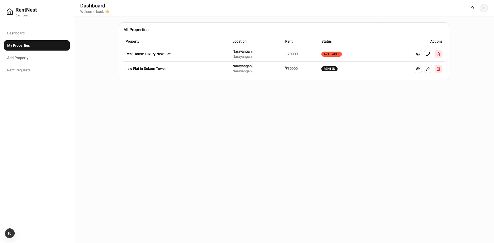
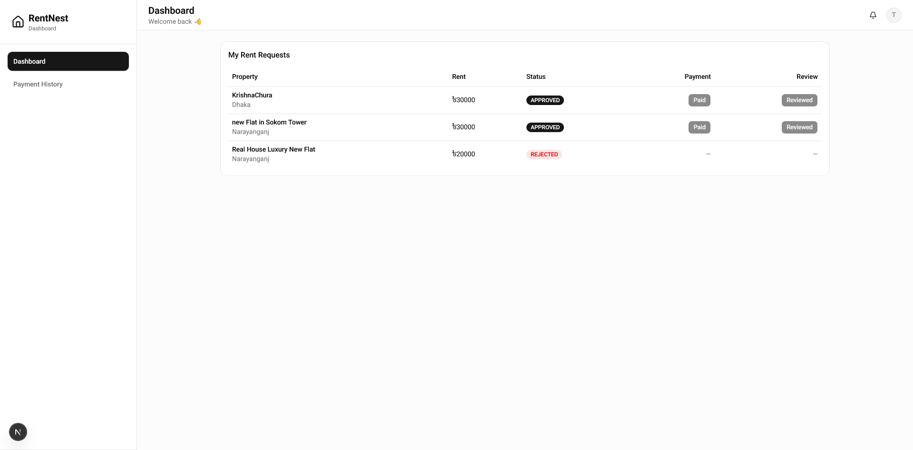

# 🏠 RentNest

RentNest is a full-stack rental property platform that connects landlords and tenants in a seamless and secure way. Landlords can list and manage rental properties, while tenants can search, request rentals, and complete online payments. The platform also includes an admin dashboard for managing users and monitoring rental activities.

---

## ✨ Features

### 👤 Authentication

- User registration and login
- JWT-based authentication
- Role-based authorization (Admin, Landlord, Tenant)
- Protected routes

### 🏡 Property Management

- Browse all available properties
- Search and filter properties
- View detailed property information
- Add, update, and delete properties (Landlord)

### 📄 Rental Requests

- Send rental requests
- Approve or reject requests (Landlord)
- Track rental request status

### 💳 Payments

- Secure online payment integration
- Payment history for tenants

### 🛠️ Admin Dashboard

- Manage users
- Activate or suspend user accounts
- View all rental requests
- Monitor pending rental requests

### 📱 Responsive UI

- Fully responsive design
- Modern interface built with Tailwind CSS and shadcn/ui

---

## 🛠️ Tech Stack

### Frontend

- Next.js
- React
- TypeScript
- Tailwind CSS
- shadcn/ui
- React Hook Form
- Zod
- Sonner

### Backend

- Node.js
- Express.js
- TypeScript
- Prisma ORM
- PostgreSQL
- JWT Authentication
- Bcrypt

### Payment

- SSLCOMMERZ

### Deployment

- Vercel (Frontend)
- Vercel (Backend)
- PostgreSQL Database

---

## 🔗 Related Repositories

- Backend: https://github.com/riday-kumar/rent-nest-server.git

---

## 🚀 Installation

### Clone the repository

```bash
git clone <repository-url>
```

### Install dependencies

Frontend

```bash
cd RENT_NEST_FRONTEND_B7_A4
npm install
```

Backend

```bash
cd backend
npm install
```

---

## ⚙️ Environment Variables

### Backend (.env)

```env
BACKEND_API_URL= your_backend_api_url

JWT_ACCESS_SECRET= your_access_secret
JWT_REFRESH_SECRET= your_refresh_secret
ACCESS_TOKEN_EXPIRES= your_access_token_expires_time
REFRESH_TOKEN_EXPIRES= your_refresh_token_expires_time
```

---

## ▶️ Run Locally

### Frontend

```bash
npm run dev
```

---

## 📚 API Documentation

The API endpoints used in this project are documented in:

```text
api_integration.md
```

---

## 📸 Screenshots





---

## 🔮 Future Improvements

- Wishlist/Favorites
- Email notifications
- Image upload with Cloudinary
- Google Maps integration

---

## 👨‍💻 Author

**Hridoy**

If you found this project useful, consider giving it a ⭐ on GitHub.
